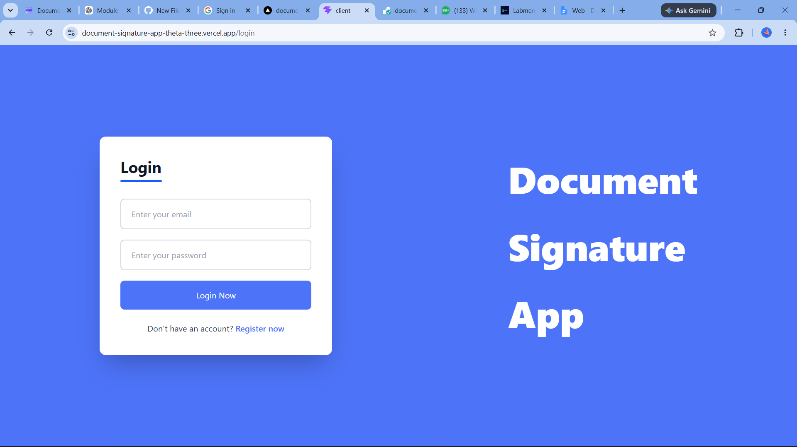
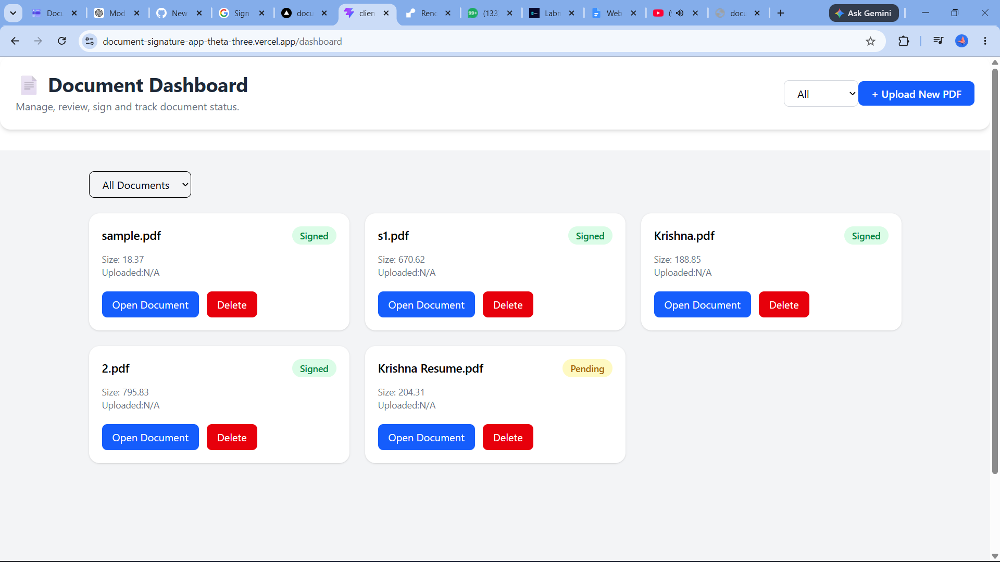
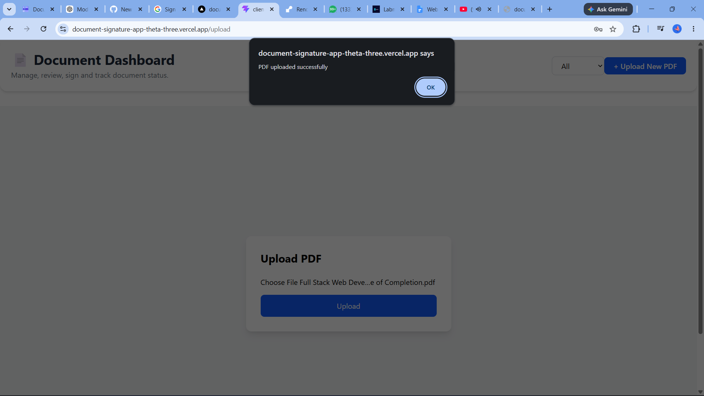
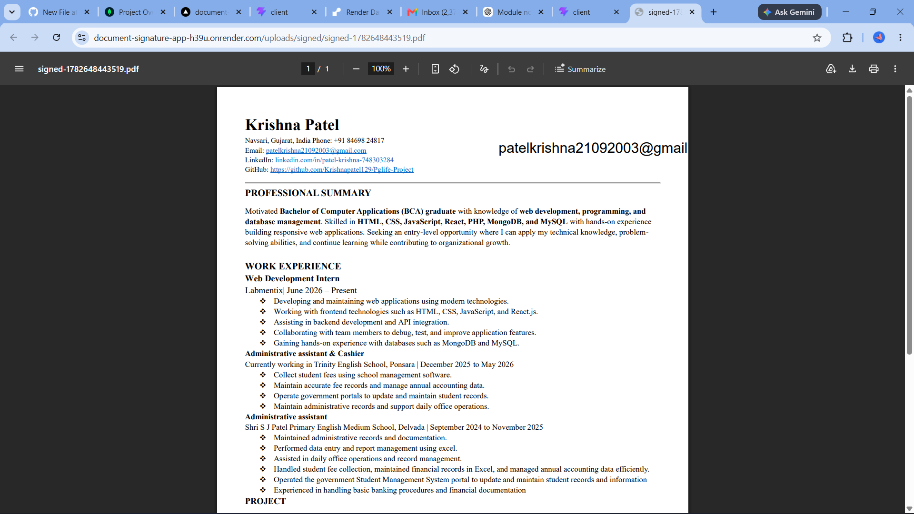
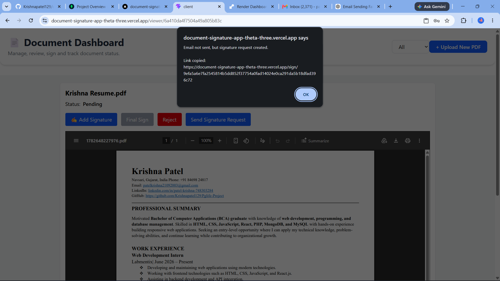
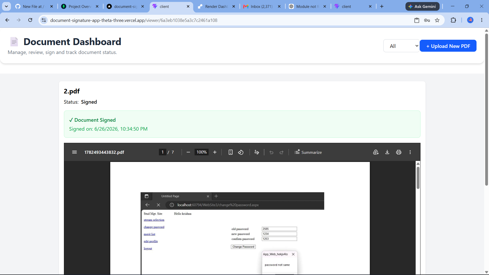
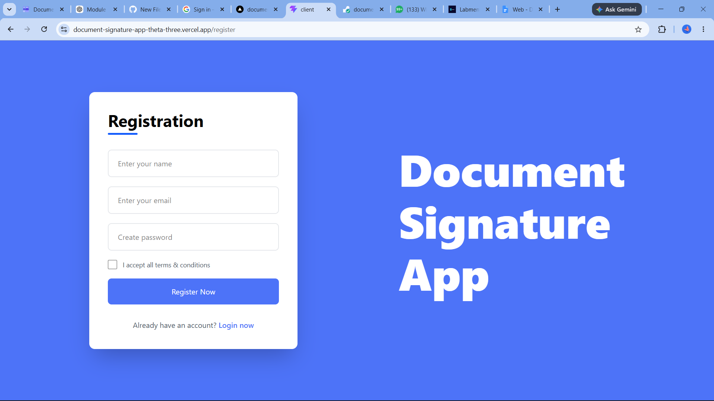
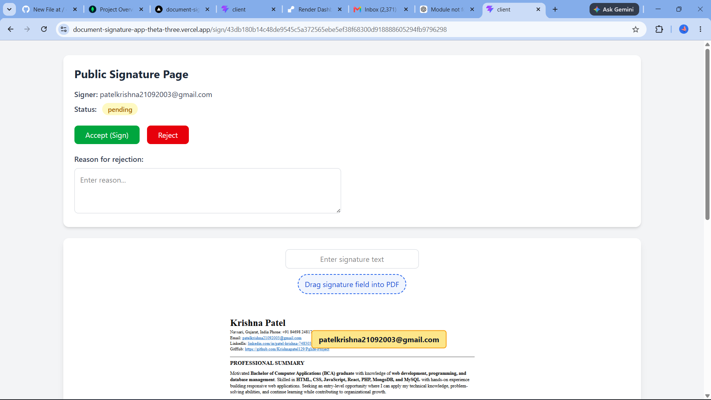

# Document Signature App

A MERN Stack web application that allows users to upload PDF documents, request signatures, sign documents digitally, and track signature status.

## Features

- User Registration & Login (JWT Authentication)
- Upload PDF Documents
- View Uploaded PDFs
- Request Signature via Email
- Place Signature on PDF
- Save Signed PDF
- Signature Status Tracking
- Dashboard Analytics
- Audit Logs
- Responsive UI

## Tech Stack

### Frontend
- React.js
- Vite
- Tailwind CSS
- Axios
- React Router

### Backend
- Node.js
- Express.js
- MongoDB
- Mongoose
- JWT Authentication
- Nodemailer
- Multer

## Installation

### Clone Repository

```bash
git clone https://github.com/yourusername/document-signature-app.git
```

### Backend

```bash
cd server
npm install
npm run dev
```

### Frontend

```bash
cd client
npm install
npm run dev
```

## Environment Variables

Create a `.env` file inside the `server` folder.

```env
PORT=5000
MONGO_URI=your_mongodb_uri
JWT_SECRET=your_secret
EMAIL_USER=your_email
EMAIL_PASS=your_password
FRONTEND_URL=http://localhost:5173
```

## Folder Structure

```
client/
server/
uploads/
signed/
```

## Future Enhancements

- OTP Verification
- Multiple Signers
- Drag & Drop Signature
- Cloud Storage
- Digital Certificate Support
- Admin Dashboard

Project Explanation

My project is a Document Signature App. It allows users to upload PDF documents, send signature requests, sign documents digitally, and track the signature status. The main goal of this project is to reduce manual paperwork and make document signing faster and easier.

Tech Stack Used

Frontend: React.js, Vite, Tailwind CSS, Axios
Backend: Node.js, Express.js
Database: MongoDB
Authentication: JWT, bcrypt
File Upload: Multer
Email: Nodemailer
PDF Handling: PDF-lib / react-pdf

Why I Used This Tech Stack

I used React.js because it helps create a fast and interactive user interface.

I used Node.js and Express.js because they are good for creating REST APIs and handling backend logic.

I used MongoDB because it stores data in JSON-like format, which works well with Node.js.

I used JWT for secure login authentication.

I used Multer to upload PDF files.

I used Nodemailer to send signature request emails.

Database

The database used in this project is MongoDB.

Main collections:
users
documents
signatures
signatureRequests
auditLogs

Schema
User Schema

{
  name: String,
  email: String,
  password: String,
  createdAt: Date
}

Signature Schema

{
  documentId: ObjectId,
  signerEmail: String,
  page: Number,
  x: Number,
  y: Number,
  status: String,
  signedAt: Date
}
{
  documentId: ObjectId,
  signerEmail: String,
  page: Number,
  x: Number,
  y: Number,
  status: String,
  signedAt: Date
}

Signature Request Schema

{
  documentId: ObjectId,
  requesterId: ObjectId,
  signerEmail: String,
  token: String,
  status: String,
  createdAt: Date
}

Screenshots of Application

1. Login Page
2. Register Page
3. Dashboard Page
4. Upload Document Page
5. PDF Viewer Page
6. Signature Request Page
7. Signing Page
8. Signed Document Page

## Screenshots

### Login Page


### Dashboard


### Upload Document


### PDF Signing Page


### signature Request page


### PDF viewer Page


### PDF Register Page


### PDF Sign page


